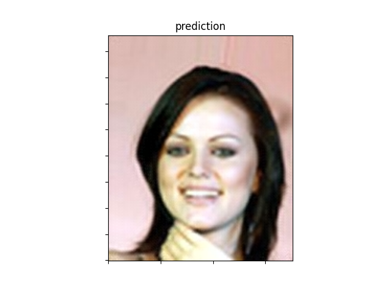
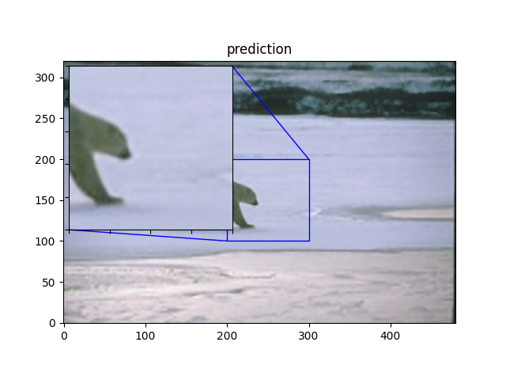

## DeepVision Image Enhancement (Python, Deep Learning)

# Overview

This set of scripts showcases the process of image enhancement using TensorFlow. The project consists of four main scripts: preprocessing.py, mapping.py, testing.py, and present.py. Each script serves a specific purpose in the overall workflow.

## Installation
Before running the scripts, make sure to install the required dependencies. You can do this by running:

```bash 
pip install tensorflow matplotlib numpy Pillow IPython keras
```

## 1. preprocessing.py

# Purpose:

This script demonstrates image preprocessing using TensorFlow's image_dataset_from_directory module. It sets up training and validation datasets for subsequent model training.

# Configuration:

```
root_dir: The root directory containing the image dataset.
crop_size: The size to which images are cropped.
upscale_factor: The factor by which images will be upscaled.
input_size: The size of the input images after cropping and scaling.
batch_size: The number of images in each training batch.
```

## 2. mapping.py

# Purpose:

Defines a scaling function and maps it to the training and validation datasets. The scaling function normalizes pixel values to the range [0, 1].

## Dependencies:

preprocessing.py: Relies on the datasets created in the preprocessing step.

## 3. testing.py

# Purpose:

Defines a custom upscale model, image processing functions, and trains the model using the provided datasets.

# Configuration:

The script includes the definition of a custom upscale model, image processing functions, and training parameters.

# Dependencies:

mapping.py: Utilizes the scaled datasets for model training.

## 4. present.py

# Purpose:

Defines functions for evaluating and visualizing the performance of the trained model.

# Configuration:

The script includes functions for processing and plotting images, calculating metrics, and displaying results.

# Dependencies:

mapping.py: Uses the test image paths and scaled datasets for evaluation.

## Running the Scripts:

Run preprocessing.py to prepare the training and validation datasets.

Run mapping.py to scale pixel values in the datasets.

Run testing.py to define, train, and save the image enhancement model.

Run present.py to evaluate the model's performance on test images and visualize the results.

# Note: Ensure that the scripts are executed in the specified order to satisfy dependencies.

Feel free to customize the configurations and parameters according to your specific requirements.

When testing my model these are incremental changes my model made to enhance my image: 







Here are some final examples: 

Example 1: 


Example 2: 


Example 3: 


--


